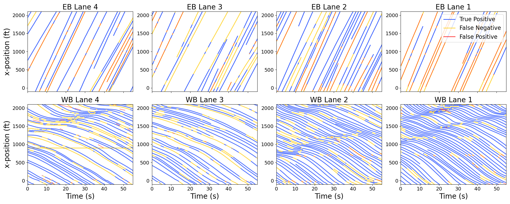

# I24-3D-dataset
## Preliminaries
This repository provides basic example data usage utilities for the I-24 Multi-Camera 3D Dataset (I24-3D). The dataset is comprised of 3 scenes (sets of videos recorded at the same time from different cameras), recorded at 4K resolution and 30 frames per second across 16-17 cameras with dense viewpoints covering 2000 feet of interstate roadway near Nashville, TN. . Vehicle 3D bounding boxes are annotated by hand for 720 unique vehicles (over 877,000 3D vehicle bounding boxes annotated in total). I24-3D is the first 3D multiple-camera tracking dataset in a traffic monitoring context from real videos.

This work is to appear at BMVC 2023. The preprint is available here: https://arxiv.org/pdf/2308.14833.pdf

If you use this code or data, please cite this work and/or give the repo a star! 

    @article{gloudemans2023i24dataset,
      title={The Interstate-24 3D Dataset: a new benchmark for 3D multi-camera vehicle tracking},
      author={Gloudemans, Derek and Wang, Yanbing and Gumm, Gracie and Barbour, William and Work, Daniel B},
      journal={arXiv preprint arXiv:2308.14833},
      year={2023}
    }

## Requirements
To use the dataset itself, there are no specific requirements (data is stored in .csv, .json, and .mp4 formats). To use the basic python scripts provided in this repository, you'll need a few python libraries:
- `pytorch`
- `numpy`
- `cv2`
- `motmetrics` (if you want to evaluate tracking results on the dataset). Available at: https://github.com/cheind/py-motmetrics

##  `scene.py` - implements the data visualization and annotation tool

      from scene import Scene  

      # create Scene object
      sc = Scene(video_directory,data_directory, scene_id = 1)

      # get objects for frame set i
      frame_data= sc.data[i]

This returns a dictionary of objects with attributes x,y,l,w,h,camera,id,timestamp,direction ; they are keyed by `<camera>_<object_id>`. Let's convert these into tensor form:
      
      cameras = [obj["camera" for obj in frame_data.values()]
      ids     = [obj["id" for obj in frame_data.values()]
      boxes   = torch.stack([torch.tensor([obj["x"], obj["y"], obj["l"], obj["w"], obj["h"], obj["direction"]]).float() for obj in frame_data.values()])
      boxes.shape >>> [n_boxes,6]
      
Now we can convert from state formulation (x,y,l,w,h) to space formulation (coordinates for fbr,fbl,bbr,bbl,ftr,ftl,fbr,fbl corners in 3-space) (front bottom right, front bottom left, back bottom left, back bottom right, etc.)
      
      boxes_space = sc.hg.state_to_space(boxes)
      boxes.shape >>> [n_boxes,8,3]

And we can convert these boxes into a specific camera field of view. As an example, we'll convert them into the FOV of `cameras[0]`. (Note that not all object boxes are likely visible in that FOV, so we could filter then on the front based on the camera x-ranges, or we can filter on the back-end by removing boxes that fall almost entirely outside of the image)
      
      keep = torch.tensor([sc.ranges[cameras[0]][0] < boxes[idx,0]]).int() * torch.tensor([sc.ranges[cameras[0]][1] > boxes[idx,0]]).int()
      keep = keep.nonzero()

      # slice only the relevant objects 
      boxes = boxes[keep,:]
      boxes_space = boxes_space[keep,:,:]
      
      boxes_im = sc.hg.space_to_im(boxes_space,name = cameras[0])
      boxes_im.shape >>> [n_boxes,8,2]    

We can similarly convert image space boxes back into space or state formulation. Because there is inherent ambiguity in a 2D->3D projection, we must provide an initial guess for the objects' heights (in feet):
      
      hgt_guess = torch.ones(boxes_im.shape[0])*5
      reprojected_state_boxes = sc.hg.im_to_state(boxes_im,name = cameras[0], heights = hgt_guess)
      reprojected_state_boxes.shape >>> [len(keep),6]

These boxes should closely align with the corresponding original boxes in `boxes`. `homography`.py provides more documentation for proper usage of this tool, and you can look at other code in this repo for examples too.

A few other attributes we can access from the `Scene` object:
      
      # get timestamps for frame set i
      sc.all_ts[i]

      # interpolate the positions for all objects (as represented by continuous splines, see paper) at time `t`:
      sc.spl_boxes(t)

Next let's check out the interactive viewer/annotator function:
      sc.run()

The following commands are available based on keystrokes:
 - `" "` - play or pause the scene
 - `9`   - advance one frame
 - `8`   - return one frame
 - `=`   - advance 20 frames
 - `-`   - return 20 frames
 - `]`   - advance one camera
 - `[`  - return one camera
 - `q`   - exit viewer
 - +`    - type a number of frames to add to the in-memory frame buffer, then press enter
 - `t`   - toggle object text labels
 - `l`   - toggle lane grid annotations
 - `m`   - toggle region of interest masks

and, for annotating:
 - `a`   - activate ADD command
 - `c`   - activate COPY PASTE command
 - `v`   - activate VEHICLE CLASS command
 - `i`   - activate INTERPOLATE command
 - `d`   - activate vehicle DIMENSION command
 - `s`    - activate SHIFT command
 - `r`   - activate DELETE command

based on the active command, mouse clicks do the following:
- ADD - add a new object
- COPY PASTE - copy an object, or paste the copied object (right click to reset copied object)
- VEHICLE CLASS  - type an object class for the clicked object, then press enter
- INTERPOLATE - linearly interpolate between annotated boxes for the clicked object
- DIMENSION - click and drag on an object to change it's x or y dimension. To change the z dimension, right click,then click and drag
- SHIFT - click and drag on an object to shift it in the x or y dimension
- DELETE - click on an object and press enter to remove all annotations for that object

The viewing and annotation tool is built more or less without handrails, so will take some trial and error to get used to.

## `export_dataset.py` 
Run this to write the frames of each scene video to disk (more convenient for e.g. training object detectors). Be warned that the image files takes up a lot of space (> 100 GB). Edit the paths to point to the main video and data directories of the dataset on your machine. By default caches 1080p frames.
    
    from export_dataset import cache_frames
    
    video_dir = "/.../I24-3D/video"
    data_dir  = "/.../I24-3D/data"
    out_dir   = "/... /I24-3D/cache"
    
    for scene_id in [1,2,3]:
        ann = Scene(video_dir,data_dir,scene_id = scene_id)
        cache_frames(ann,output_directory = out_dir)

## `multitask_dataset.py` 
Implements a standard pytorch `dataset` object configured for this dataset. This dataset expects frames saved to disk in the format output by `export_dataset` (reading from raw videos is much too slow). Edit the paths to point to directory where you exported dataset frames to.

    from multitask_dataset import I24_Dataset
    
    dataset_dir = "/.../I24-3D/cache"
    mask_dir    = "/.../I24-3D/data/mask" # for masking irrelevant portions of each frame
    
    test = I24_Dataset(dataset_dir,
                       label_format = "8_corners",
                       mode = "train",
                       multiple_frames=True,
                       mask_dir = mask_dir)
    
    # show 10 random data examples
    for i in range(10):
        idx = np.random.randint(0,len(test))
        test.show(10)
    cv2.destroyAllWindows()

## `evaluate.py`
Evaluate tracking results against the ground truth spline objects. A variety of metrics are produced including clearMOT and HOTA metrics. Data is expected in the same format at sceneX_splobj.json (a list of objects, each a dictionary with attributes: id,l,w,h,x_position (array), y_position (array), timestamp (array), class, direction)
   
    from evaluate import evaluate
    gt_path   = "/.../I24-3D/data/spl_obj/scene3_splobj.json"
    pred_path = "/.../I24-3D/data/track/scene3_tracklets.json"  # example results included in dataset
    results = evaluate(gt_path,
                        pred_path,
                        plot = True,
                        iou_threshold = 0.3)

    
## TODO
- [X] Save annotations as flat file
- [X] Save homography data as flat file
- [X] Save spline object data as flat file
- [X] Save timestamps as flat file
- [X] Nest homgraphy code nicely
- [X] Update homography to use curve offset parameters and load from JSON
- [X] Implement CSV - dataloader
- [X] Implement JSON spline dataloader
- [X] Implement timestamp file dataloader
- [X] Make a simple DataHandler object that serves up annotations, timestamps and frames with sweet sweet precision and does basic things
- [X] Make a simple viz tool that shows objects, spline objects, masks, roadway grid, and object details
- [X] Make a no-handrails annotation tool

- [X] Cache evaluation runs from database as files
- [X] Get evaluation script to work with the above file structure
- [ ] Stash all previous code and data on a hard drive never to be seen or used again!
- [ ] Make a beautiful beautiful readme
- [ ] Update the manuscript

## Notes
- `cv2`-based video decoding is painfully slow (decoding 16ish 4k video buffers on cpu generally proceeds at less than 1 fps). Moreover, `cv2` `VideoCapture` objects don't provide an easy way to jump to a point in the video, so you're stuck retrieving each frame to get to later frames. For faster decoding (~10 fps) you can write an asynchronous loader or try out [Nvidia's VPF library](https://github.com/NVIDIA/VideoProcessingFramework) for GPU side decoding directly into pytorch tensors. This library isn't utilized in this work because the installation can be quite painful and has soft-failure dependencies.
- Buffered 4K frames quickly fill memory, making this dataset a bit of a pain to work with in video form. 
- For speed and buffer memory reasons, it is recommended to save frames to disk using the provided script whenever working with data from a single frame or batches of single frames at a time.
- Ground truth data of this size is likely to contain some annotation errors. Do not raise these as issues as they will quickly overwhelm the feed and be lost. If you care to report or correct these issues to improve data quality, please do so by adding a line to the `issue_tracker.csv` reporting the issue and submit a pull request.
- The original, uncorrected timestamps are available in files (e.g. scene1_ts_orig.csv) which feature numerous timing issues detailed in the supplement of our paper.

